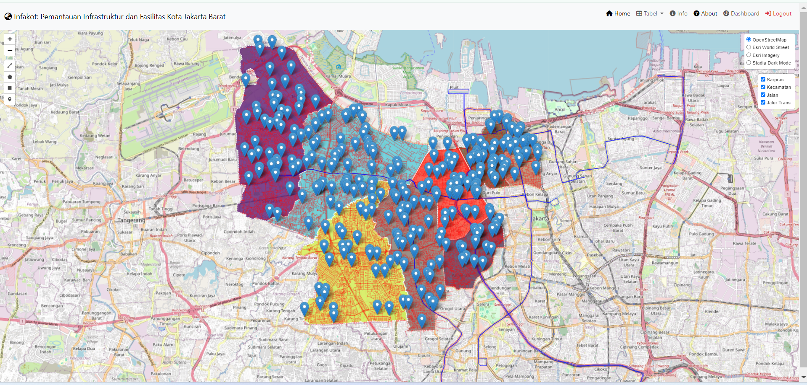
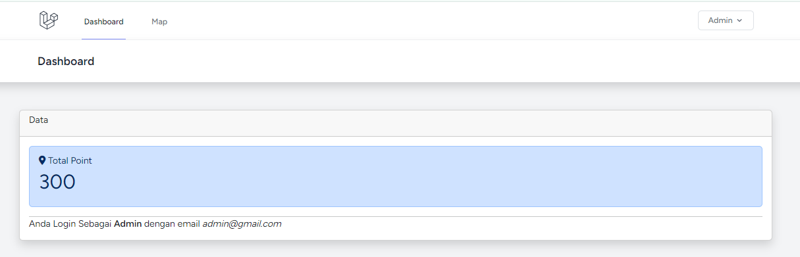
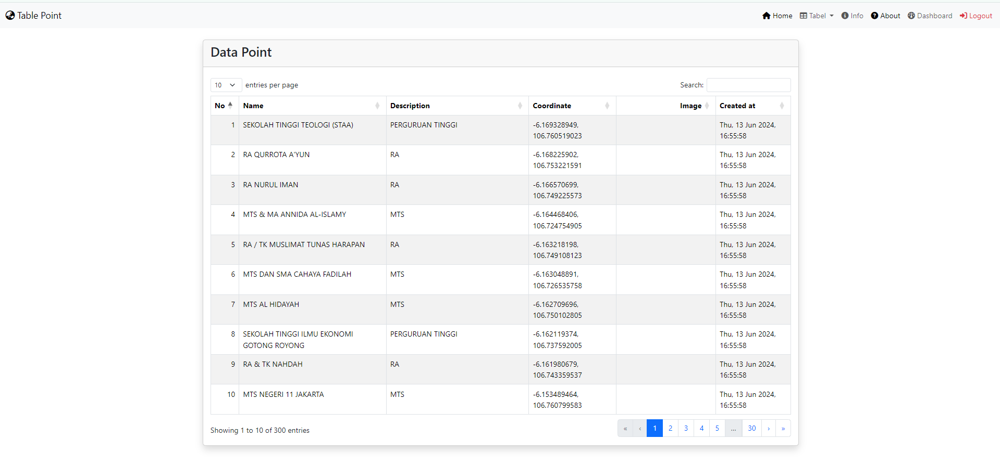
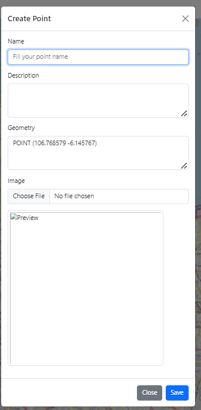
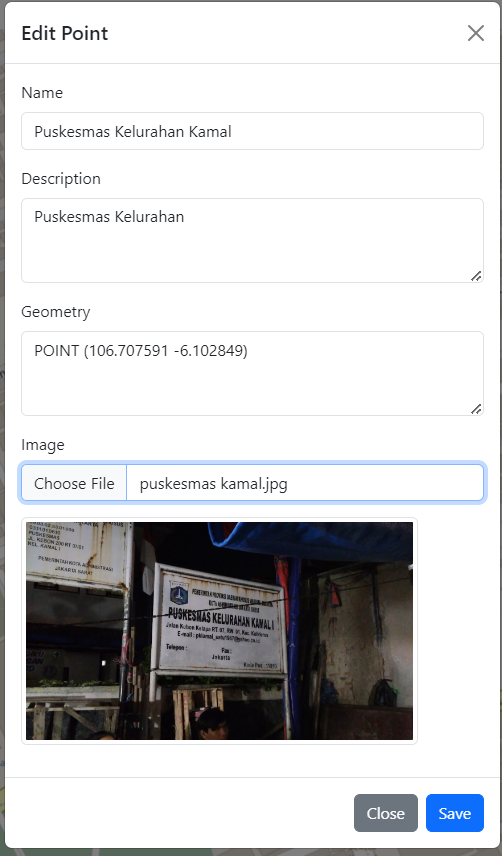
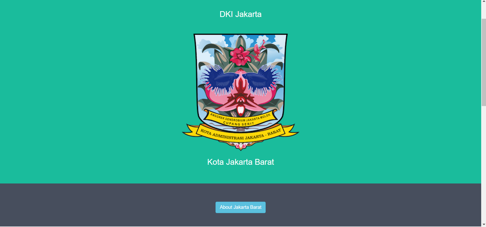
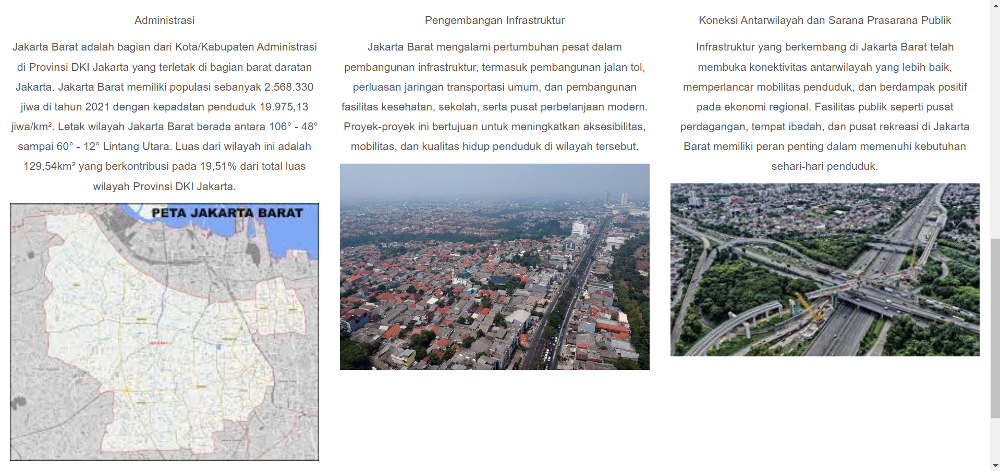
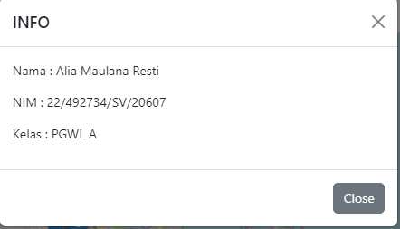

# pgwl-responsi
<h2> Infakot: Pemantauan Infrastruktur dan Fasilitas Kota Jakarta Barat </h2>
<h2> Deskripsi produk </h2>

Infakot adalah sebuah platform yang digunakan untuk memantau secara efektif infrastruktur dan fasilitas kota menggunakan teknologi digital dan sistem informasi. Website ini mencakup pengembangan sistem yang dapat mengintegrasikan data dari berbagai sumber untuk memberikan pemantauan real-time terhadap kondisi infrastruktur dan fasilitas kota. Tujuan utama dari proyek ini adalah meningkatkan efisiensi dalam pengelolaan infrastruktur dan memberikan informasi yang akurat kepada para pemangku kepentingan kota.

<h2> Komponen pembangun produk </h2>
<ul>
  <li>HTML: Menyediakan kerangka dasar untuk membangun konten dan struktur halaman web.</li>
  <li>CSS: Mengontrol tampilan elemen HTML serta tata letak dan desain halaman web.</li>
  <li>Leaflet.js Library: Library JavaScript yang digunakan untuk menghassilkan peta interaktif.</li>
  <li>Geoserver: Server GIS yang digunakan untuk menyimpan dan mengelola data geospasial.</li>
  <li>Dbeaver: Penyimpanan Database data spasial pada peta.</li>
  <li>Laravel: Framework PHP yang  digunakan untuk pengembangan web. Framework ini menyediakan berbagai komponen yang mempermudah pembangunan aplikasi web dengan cara yang terstruktur dan efisien</li>

</ul>

<h2>Sumber Data:</h2>

<ul>
  <li>Data Shapefile RBI Jaringan Jalan, Jaringan Trans Jakarta, dan Titik Sarana Prasaran</li>
  <li>Data Lokasi Koordinat Titik Lokasi Sarana dan Prasarana yang diambil dari Google Maps dan Google Earth</li>

</ul>

<h2>Tangkapan Layar Komponen Penting</h2>
<ol>

1. **Halaman Login**

    

2. **Map (Integrasi WebGIS dan Database)**
    

3. **Halaman Dashboard**
    
   
4. **Tabel**
   

5. **Fungsi Update dan Create Data**

   
   

6. **Halaman About**
  
  

5. **Info**

   
</ol>
